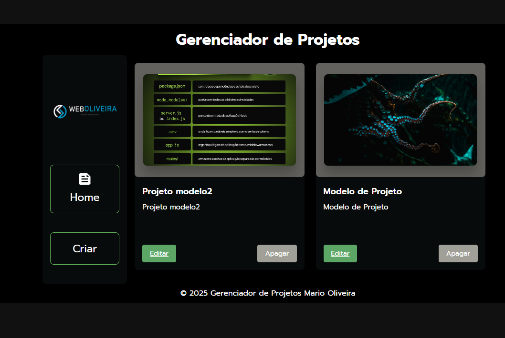

# Gerenciador de Projetos
Este é um projeto de gerenciamento de projetos desenvolvido em React e Supabase.


<p align="center">
  
</p>

> Uma rede social para desenvolvedores compartilharem seus projetos e conectarem-se com outros profissionais da área.

Este projeto foi desenvolvido como parte do curso de React e Supabase, com o objetivo de criar uma aplicação full-stack utilizando tecnologias modernas.

---

### 📋 Tabela de Conteúdos
- [Funcionalidades](#-funcionalidades)
- [Tecnologias Utilizadas](#-tecnologias-utilizadas)
- [Pré-requisitos](#-pré-requisitos)
- [Como Rodar o Projeto](#-como-rodar-o-projeto)
  - [Configuração do Supabase](#-configuração-do-supabase)
  - [Configuração Local](#-configuração-local)
- [Estrutura do Projeto](#-estrutura-do-projeto)
- [Contribuindo](#-contribuindo)
- [Licença](#-licença)

---

### ✨ Funcionalidades

- [x] **Autenticação de Usuários:** Login e registro utilizando o Supabase Auth.
- [x] **CRUD de Posts:** Criação, leitura, atualização e exclusão de postagens.
- [x] **Upload de Imagens:** Armazenamento de imagens no Supabase Storage (Buckets).
- [x] **Segurança:** Políticas de acesso a nível de linha (Row Level Security - RLS) para garantir que usuários só possam modificar seus próprios posts.
- [x] **Listagem e Visualização:** Página inicial com a listagem de todos os posts da comunidade.

---

### 🚀 Tecnologias Utilizadas

O projeto foi construído com as seguintes tecnologias:

- **Front-end:**
  - [React](https://react.dev/)
  - [Vite](https://vitejs.dev/)
- **Back-end as a Service (BaaS):**
  - [Supabase](https://supabase.com/)
    - **Autenticação:** Supabase Auth
    - **Banco de Dados:** Supabase Database (PostgreSQL)
    - **Armazenamento:** Supabase Storage
- **Linguagem:**
  - JavaScript (com Async/Await para requisições)

---

### ✅ Pré-requisitos

Antes de começar, você precisará ter instalado em sua máquina:
- Node.js (versão 18.x ou superior)
- Git
- Um gerenciador de pacotes como npm ou Yarn
- Uma conta gratuita no Supabase

---

### 🛠️ Como Rodar o Projeto

Siga os passos abaixo para configurar e executar o projeto em seu ambiente local.

#### 🌐 Configuração do Supabase

1.  **Crie um novo projeto no Supabase:**
    - Acesse o dashboard do Supabase e crie um novo projeto. Guarde a senha do seu banco de dados em um local seguro.

2.  **Obtenha as chaves de API:**
    - No painel do seu projeto, vá para **Project Settings** (ícone de engrenagem) > **API**.
    - Você precisará do **Project URL** e da chave **anon public**.

3.  **Configure o Banco de Dados:**
    - Vá para o **SQL Editor** no painel do Supabase.
    - Crie as tabelas necessárias para a aplicação. Por exemplo, a tabela `posts`.
      ```sql
      -- Exemplo de SQL para criar a tabela de posts
      CREATE TABLE posts (
        id bigint GENERATED BY DEFAULT AS IDENTITY PRIMARY KEY,
        created_at timestamp with time zone DEFAULT now() NOT NULL,
        title text NOT NULL,
        content text,
        image_url text,
        author_id uuid REFERENCES auth.users(id) NOT NULL
      );
      ```
    - **Habilite o Row Level Security (RLS):** É crucial para a segurança da aplicação.
      ```sql
      -- Habilita RLS na tabela de posts
      ALTER TABLE posts ENABLE ROW LEVEL SECURITY;
      ```
    - **Crie as Políticas de Acesso (Policies):**
      ```sql
      -- Permite que todos leiam os posts
      CREATE POLICY "Allow all read access" ON posts FOR SELECT USING (true);

      -- Permite que usuários autenticados criem posts
      CREATE POLICY "Allow authenticated users to insert" ON posts FOR INSERT WITH CHECK (auth.role() = 'authenticated');

      -- Permite que o autor do post o atualize ou delete
      CREATE POLICY "Allow author to update/delete" ON posts FOR UPDATE USING (auth.uid() = author_id);
      CREATE POLICY "Allow author to delete" ON posts FOR DELETE USING (auth.uid() = author_id);
      ```

4.  **Configure o Storage (Armazenamento):**
    - No painel, vá para **Storage** e crie um novo **Bucket**. Por exemplo, `post-images`.
    - Defina as políticas de acesso do bucket para permitir que usuários autenticados façam upload e que todos possam visualizar as imagens.

#### 💻 Configuração Local

1.  **Clone o repositório:**
    ```bash
    git clone https://github.com/marioleme/CRUD-COM-SUPABASE
    ```

2.  **Acesse o diretório do projeto:**
    ```bash
    cd CRUD-COM-SUPABASE-main
    ```

3.  **Instale as dependências:**
    ```bash
    npm install
    ```

4.  **Configure as variáveis de ambiente:**
    - Crie um arquivo chamado `.env.local` na raiz do projeto.
    - Adicione as chaves do Supabase que você obteve anteriormente:
      ```env
      VITE_SUPABASE_URL="SUA_URL_DO_PROJETO_SUPABASE"
      VITE_SUPABASE_ANON_KEY="SUA_CHAVE_ANON_PUBLICA_SUPABASE"
      ```
    - Substitua os valores pelas suas credenciais.

5.  **Execute a aplicação:**
    ```bash
    npm run dev
    ```
    - O servidor de desenvolvimento será iniciado. Abra seu navegador e acesse `http://localhost:5173`.

---

### 📁 Estrutura do Projeto

A estrutura de pastas principal do projeto é a seguinte:

```
/
├── public/                # Arquivos estáticos
├── src/
│   ├── assets/            # Imagens, fontes e outros recursos
│   ├── components/        # Componentes React reutilizáveis
│   ├── contexts/          # Contextos da aplicação (ex: Autenticação)
│   ├── pages/             # Páginas da aplicação (Home, Post, etc.)
│   ├── services/          # Lógica de comunicação com a API (Supabase)
│   ├── App.jsx            # Componente principal que define as rotas
│   └── main.jsx           # Ponto de entrada da aplicação
├── .env.local             # Arquivo com as variáveis de ambiente (não versionado)
├── index.html             # Template HTML principal
└── package.json           # Dependências e scripts do projeto
```

---

### 🤝 Contribuindo

Contribuições são bem-vindas! Se você tem alguma ideia para melhorar o projeto, siga os passos:

1.  Faça um **Fork** do projeto.
2.  Crie uma nova **Branch** (`git checkout -b feature/sua-feature`).
3.  Faça o **Commit** de suas alterações (`git commit -m 'feat: Adiciona nova feature'`).
4.  Faça o **Push** para a Branch (`git push origin feature/sua-feature`).
5.  Abra um **Pull Request**.

---

### 📄 Licença

Este projeto está sob a licença MIT. Veja o arquivo LICENSE para mais detalhes.
